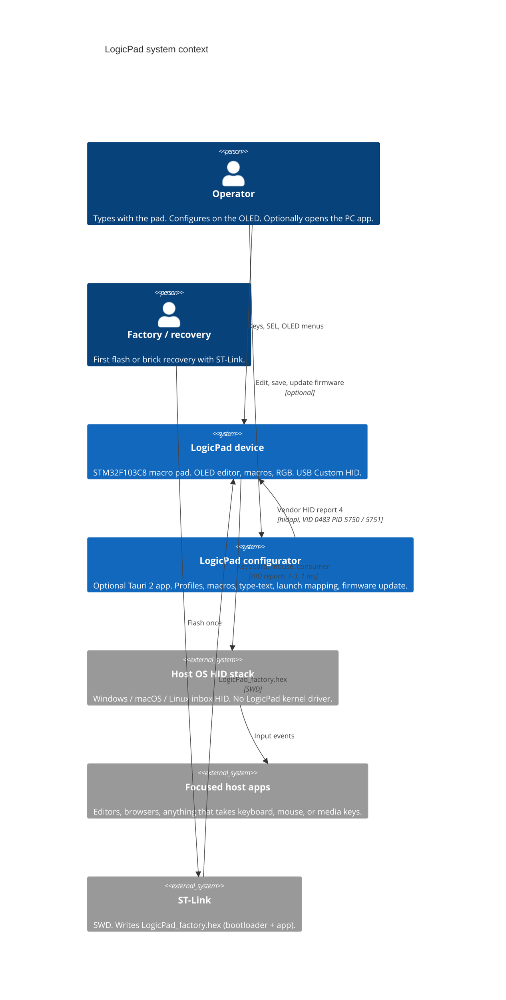
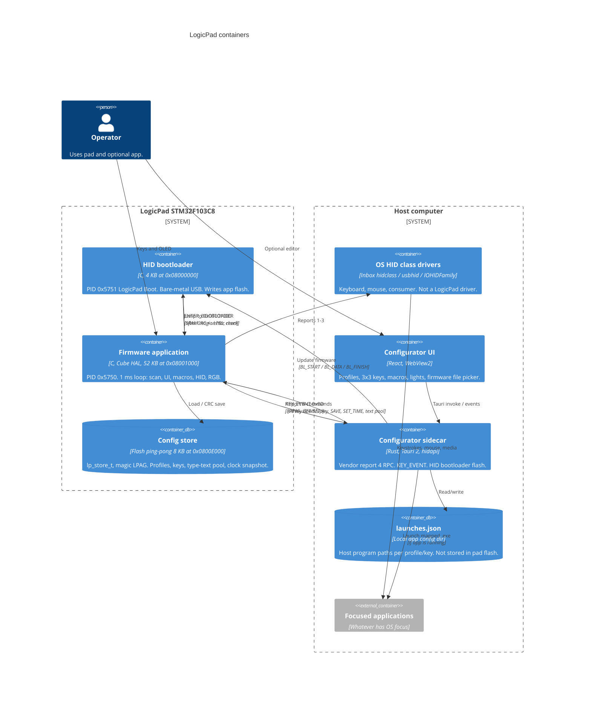
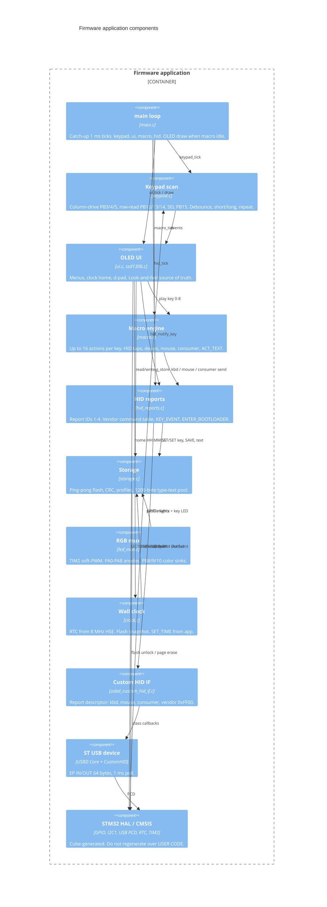
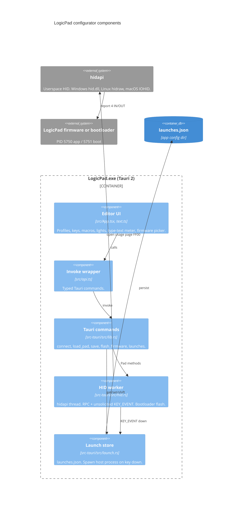
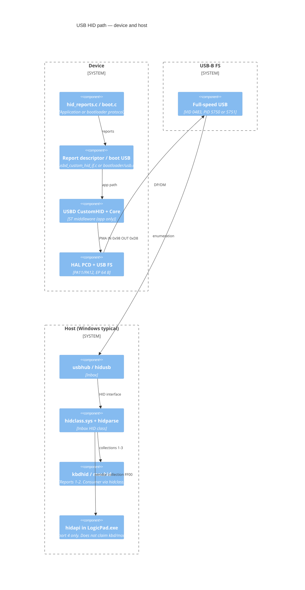

# LogicPad C4 model

C4 diagrams of the firmware, optional desktop app, and USB HID path. There is **no custom kernel driver**: reports 1–3 use inbox OS HID; report 4 is opened in userspace by hidapi.

Sources: `AGENTS.md`, `HID_PROTOCOL.md`, `Pinout.md`, `OLED_UI.md`, `03 Firmware/`, `04 Software/logicpad-app/`.

How to read:

| Level | What it shows |
|-------|----------------|
| 1 Context | People and systems around LogicPad |
| 2 Containers | Deployable pieces (firmware images, OS HID, Tauri app) |
| 3 Components | Modules inside firmware, the desktop app, and the USB/HID stack |
| 4 Code | Flash map, HID reports, vendor commands |

---

## Level 1 — System context

The pad is a USB HID keyboard/mouse/media device on its own. The configurator is optional. Factory programming uses ST-Link once; later updates use the HID bootloader.

---

## Level 2 — Containers

One USB Custom HID interface. The OS claims reports 1–3. The app opens only the vendor collection (usage page `0xFF00`) so typing continues while the app is connected.

Linux: hidapi needs hidraw access. The udev rule in the app README is a permission grant, not a driver.

---

## Level 3 — Firmware application

Main loop is 1 ms in `main.c`. USB IN/OUT is interrupt-driven through ST’s device library. Bootloader USB is a separate bare-metal stack (`bootloader/usb.c`), not this diagram.

Hardware pins: [Pinout.md](Pinout.md). OLED screens: [OLED_UI.md](OLED_UI.md).

---

## Level 3 — Desktop configurator

The UI never opens HID itself. Rust owns hidapi, filters to vendor report 4 (Windows also skips desktop/consumer collections), and emits `pad-key` / `flash-progress`.

---

## Level 3 — USB / HID stack (no custom driver)

Device and host as layers. The bootloader does **not** use the ST USB library; it bit-bangs the same USB FS peripheral in `bootloader/usb.c`.

| Host | Reports 1–3 | Report 4 |
|------|-------------|----------|
| Windows | hidclass + kbdhid/mouhid | hidapi → hid.dll (skip usage 1/2/0x0C) |
| macOS | IOHIDFamily | hidapi |
| Linux | usbhid + evdev | hidraw; udev `99-logicpad.rules` for unprivileged open |

---

## Level 4 — Code: flash map and reports

STM32F103C8: 64 KB flash, 20 KB SRAM. ROM bootloader is USART-only, so field update is the 4 KB HID bootloader.

| Region | Address | Size | Image |
|--------|---------|------|--------|
| HID bootloader | `0x08000000` | 4 KB | `LogicPad_factory.hex` only |
| Application | `0x08001000` | 52 KB | `LogicPad.bin` (and factory hex) |
| Config store | `0x0800E000` | 8 KB | ping-pong `lp_store_t` |
| SRAM magic | `0x20004FFC` | word | `LPBL` → stay in bootloader |

| Report | Size | Who | Role |
|--------|------|-----|------|
| 1 | 9 | OS | Keyboard 6KRO |
| 2 | 5 | OS | Mouse |
| 3 | 3 | OS | Consumer 16-bit |
| 4 | 64 | App / bootloader | Vendor commands |

App vendor commands: `HID_PROTOCOL.md`. Bootloader: `0x40–0x43` (`BL_START`, `BL_DATA`, `BL_FINISH`, `BL_ABORT`).

Store schema: `03 Firmware/Firmware/Core/Inc/storage.h` (`lp_store_t`, magic `0x4C504147`).

---

## Runtime paths (code-level)

**Live key (no app):** keypad scan → `ui` live → `macro_play` → `hid_kbd_send` / mouse / consumer → USBD → OS HID → focused app.

**Live key (app running, launch mapped):** same HID 1–3 path, plus `hid_notify_key` → report 4 `KEY_EVENT` → hidapi worker → `LaunchStore::launch`.

**Save from app:** React → `save_store` → `CMD_SAVE` → `storage_save` → flash CRC slot.

**Update firmware:** app sends `ENTER_BOOTLOADER` → OLED **FLASH / BOOT MODE** → reset with `LPBL` → PID `0x5751` → `BL_*` writes `0x08001000` → jump to app. Recovery: hold SEL on plug-in.
