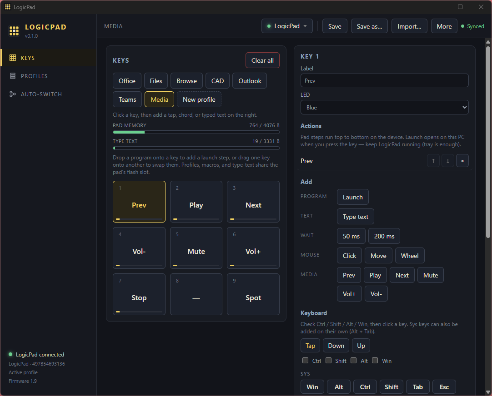
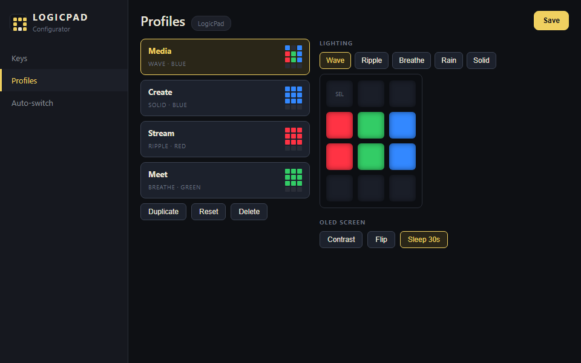
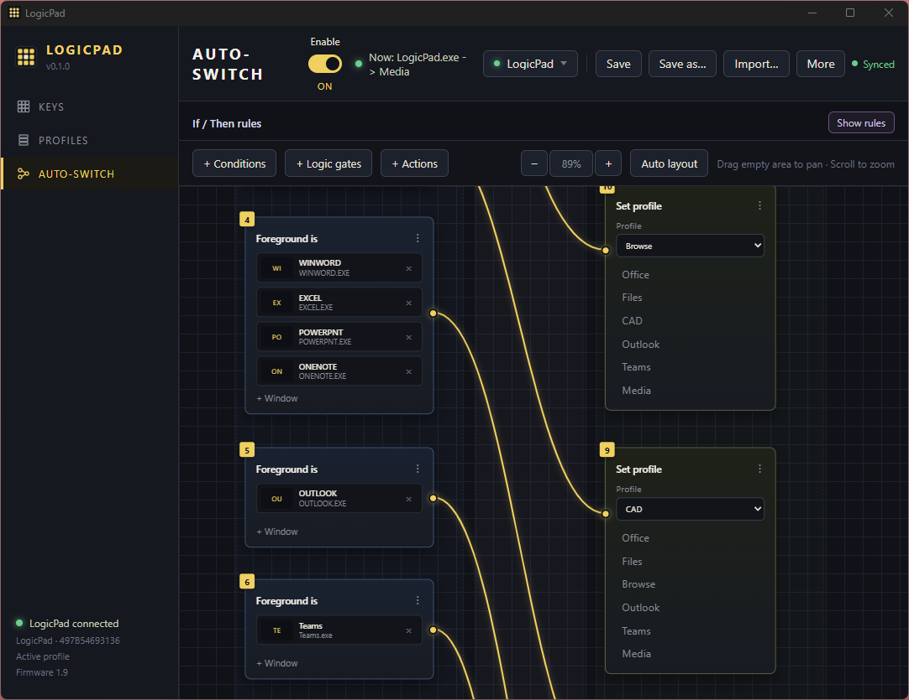
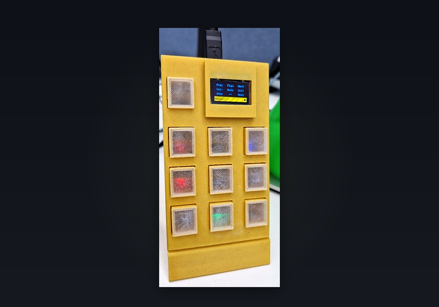
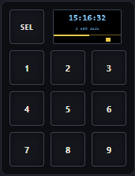

  

<h1 align="center">LogicPad</h1>

  <strong>A programmable USB macro pad — and a desktop app that makes it yours.</strong> 
  Assign macros, build lighting profiles, auto-switch layouts per app, back up your setups, and update firmware — all over USB.

  
  
  
  

  <a href="#-logicpad-configurator">Configurator</a> ·
  <a href="#-features">Features</a> ·
  <a href="#-hardware">Hardware</a> ·
  <a href="#-quick-start">Quick start</a> ·
  <a href="https://git.erhancm.com/erhan/LogicPad/releases">Download app</a>

---

## 💻 LogicPad configurator

LogicPad shows up as a standard USB keyboard when you plug it in, so it works without any software. The **Windows, macOS, and Linux** configurator app (built with Tauri 2) gives you a full-screen key editor, YAML profile packs, automatic profile switching based on which app you're using, and **firmware updates over USB**.

<table>
  <tr>
    <td colspan="2" align="center">
      
       <b>Keys</b> — macros, chords, typed text, and drag-and-drop PC program launch
    </td>
  </tr>
  <tr>
    <td width="50%" align="center">
      
       <b>Profiles</b> — wave, ripple, breathe &amp; rain lighting · per-key colours · OLED settings
    </td>
    <td width="50%" align="center">
      
       <b>Auto-switch</b> — switch profiles when you focus or run specific apps
    </td>
  </tr>
</table>

### Try it without hardware

The app has a built-in simulated LogicPad so you can try everything without owning the physical board. Note that the software is still a work in progress — some features aren't implemented yet.

### Install the app

Download from **[Releases](https://git.erhancm.com/erhan/LogicPad/releases)**:

| Platform | Download | Install |
|----------|----------|---------|
| **Windows** | `LogicPad_*_x64-setup.exe` | Run the installer |
| **macOS** | `LogicPad_*_x64.dmg` | Open the DMG, drag LogicPad to Applications |
| **Linux** | `LogicPad_*_amd64.AppImage` | `chmod +x LogicPad_*.AppImage && ./LogicPad_*.AppImage` |
| **Linux** | `logicpad-app_*_amd64.deb` | `sudo apt install ./logicpad-app_*_amd64.deb` |
| **All** | `LogicPad-Productivity.yaml` | Import in the app (**Import…**) Example configuration |

**Linux note:** You'll need to install a [udev rule](04%20Software/logicpad-app/README.md#linux-udev) so the app has permission to communicate with the pad over USB. Without it, the app can't detect the device.

**Build from source:** `cd "04 Software/logicpad-app" && npm install && npm run build:app`

**Showcase demo:** [`04 Software/logicpad-app/showcase/`](04%20Software/logicpad-app/showcase/) comes with five pre-built profiles.

**Full app docs:** [`04 Software/logicpad-app/README.md`](04%20Software/logicpad-app/README.md)

---

## 🎯 Features

| | |
|---|---|
| **Keys** | A 3×3 grid of macro keys. Each key can trigger a keyboard shortcut, mouse click, media control or typed string (up to 240 bytes per key). You can also launch a PC program directly from a key. |
| **Profiles** | Create as many profiles as the internal flash allows. Each profile has its own lighting mode (wave, ripple, breathe, rain) or per-key RGB colours. |
| **Auto-switch** | A visual node graph lets you define rules like "when Spotify is focused, switch to the Media profile." Supports foreground-app and running-app checks, AND/OR logic gates.
| **YAML packs** | Export your entire setup — profiles, key mappings, and auto-switch rules — to a single YAML file. Import it later or share it with others. Use **Save as…** / **Import…** in the app. |
| **On-board bootloader** | Every board has a 4 KB USB HID bootloader. After the first flash, you can update firmware straight from the app — no ST-Link or disassembly needed. If something goes wrong, hold **SEL** while plugging in to enter recovery mode. |
| **On-device OLED editor** | Don't have the app? You can configure keys, profiles, and settings entirely from the pad's OLED screen using the selector and the nine keys as a d-pad. |
| **Plug-and-play HID** | LogicPad appears as a standard USB keyboard, mouse, and media device. No custom drivers needed on Windows, macOS, or Linux. |
| **Open hardware** | Full KiCad schematic and PCB layout. |

---

## 🔩 Hardware

  

  <em>9 macro keys + selector · 0.96″ OLED · per-key RGB · STM32F103 · 3D-printable enclosure</em>

| Spec | Detail |
|------|--------|
| MCU | STM32F103C8 (ARM Cortex-M3) — 64 KB flash, 20 KB RAM |
| Keys | 9 macro keys + 1 selector button |
| Display | 0.96″ SSD1306 OLED, 128×64 pixels, connected over I²C |
| Lighting | Per-key RGB using 2020-size LEDs |
| USB | Composite HID device — keyboard + mouse + media controls + vendor-specific reports for app communication |
| Flash map | **4 KB** bootloader · **52 KB** application · **8 KB** persistent config store |

Current hardware revision: **V0.2** in [`02 Electronics/V0.2/`](02%20Electronics/V0.2/).

### Firmware updates

Every LogicPad board has a **4 KB USB HID bootloader** baked into flash. Once the board has been programmed for the first time, all future firmware updates happen over a regular USB cable — no ST-Link, no SWD debugger, and no need to open the enclosure.

**Updating firmware:**

1. Build the application firmware with the `Release` CMake preset in [`03 Firmware/Firmware/`](03%20Firmware/Firmware/).
2. Open the configurator app, click **Update firmware**, and select your `LogicPad.bin` file. The app communicates with the bootloader over USB HID and flashes the new image.

**Recovery:** If a firmware update fails or the app won't boot, hold the **SEL** button while plugging in the USB cable. This forces the board into bootloader mode so you can re-flash.

**First-time programming** still requires an ST-Link programmer (one-time only). The factory image `LogicPad_factory.hex` bundles both the bootloader and the application. See [`03 Firmware/bootloader/README.md`](03%20Firmware/bootloader/README.md) for details.

---

## 🚀 Quick start

### Daily use (no app needed)

1. **Plug in USB.** The host OS recognises LogicPad as a standard HID keyboard (plus mouse and media controls if you've configured them). No drivers, no pairing — it just works.

2. **Navigate the OLED menus.** A short press on the **selector** (SEL) button opens the on-device menu. Inside menus, the nine keys double as a d-pad for navigation:

   <table>
     <tr>
       <td width="55%">
         <table>
           <tr><th>Key</th><th>Action</th></tr>
           <tr><td>2</td><td>Up</td></tr>
           <tr><td>8</td><td>Down</td></tr>
           <tr><td>4</td><td>Left</td></tr>
           <tr><td>6</td><td>Right</td></tr>
           <tr><td>5</td><td>OK (select)</td></tr>
         </table>
         
<strong>Short press SEL</strong> = go back one level. 
       </td>
       <td width="45%" align="center">
         
       </td>
     </tr>
   </table>

3. **Assign your macros.** Factory boards ship with empty key slots. You can assign macros either from the OLED menu (no PC required) or from the app. The app has more options.

### Build firmware from source

You'll need an ARM GCC toolchain and CMake. Both the bootloader and application firmware use CMake presets.

1. **Build the bootloader** — open [`03 Firmware/bootloader/`](03%20Firmware/bootloader/) and build with the `Release` CMake preset.
2. **Build the application** — open [`03 Firmware/Firmware/`](03%20Firmware/Firmware/) and build with the `Release` CMake preset.
3. **First-time flash** — combine bootloader + app into `LogicPad_factory.hex` and flash it via ST-Link (this is the only time you need ST-Link).
4. **All later updates** — just click **Update firmware** in the configurator app and point it at your new `LogicPad.bin`. The on-board bootloader handles the rest over USB.

---

## 📁 Repository layout

The repo is organised by discipline, numbered so it sorts in a logical order:

| Path | Contents |
|------|----------|
| [`04 Software/logicpad-app/`](04%20Software/logicpad-app/) | Desktop configurator app — Tauri 2 (Rust + web frontend). Handles key editing, profile management, auto-switch rules, YAML import/export, and firmware updates. |
| [`03 Firmware/Firmware/`](03%20Firmware/Firmware/) | Production firmware for the STM32F103. CMake-based build with ARM GCC. Handles USB HID, key scanning, OLED display, RGB lighting, and config storage. |
| [`03 Firmware/bootloader/`](03%20Firmware/bootloader/) | On-board USB HID bootloader. Occupies the first 4 KB of flash and allows firmware updates over USB without a debugger. |
| [`02 Electronics/V0.2/`](02%20Electronics/V0.2/) | KiCad schematic and PCB layout for the current board revision, plus BOM and Gerber files for manufacturing. |
| [`01 Documentation/`](01%20Documentation/) | Hardware and protocol docs — MCU pinout, HID report format, OLED menu structure, and C4 architecture diagrams. |
| [`docs/readme/`](docs/readme/) | Images used in this README. |

---

## 📖 Documentation

- [Pinout](01%20Documentation/Pinout.md) — MCU pin assignments, key matrix wiring, OLED connections, and RGB data lines
- [HID protocol](01%20Documentation/HID_PROTOCOL.md) — USB HID report format and vendor-specific commands used by the configurator app
- [OLED UI](01%20Documentation/OLED_UI.md) — on-device menu structure and navigation flow
- [C4 architecture](01%20Documentation/C4_MODEL.md) — high-level system overview in C4 model notation

---

## 🤝 Contributing

Contributions are welcome — whether it's a bug report, a feature request, or a pull request. If you're planning a larger change, it's worth opening an issue first to discuss the approach. By contributing, you agree that your contributions will be licensed under [Apache 2.0](LICENSE).

---

## 🐛 Known issues

| Issue | Type | Status | Notes |
|-------|------|--------|-------|
| Sometimes you can't pan across the node editor when clicking on an empty area and dragging the mouse | Software | Open | Needs more investigation |
| OLED flicker or banding when taking pictures with camera| Software | Open | To do with refresh rate |
| Standby Clock setting is not persistant | Firmware | Open | When powering the unit off and on, the standby clock is reset to the default setting |
| Not all standby clock styles work | Software + Firmware | Open | Needs more investigation |
| LEDs can't reach full brightness in custom lighting modes | Hardware | Open | The LEDs are scanned one key at a time (1/9 duty cycle), so each LED is only actually on for a fraction of the time — the rest just looks lit because of persistence of vision. The STM32F103's GPIO pins can't source enough current to drive all 27 LEDs (9 keys × 3 colours) at once, so the per-LED brightness is capped by the scan rate. |

---

## 📝 To-do

| Feature | Type | Status | Notes |
|---------|------|--------|-------|
| Custom scripting assignable to each button | Software | Planned | Python/Lua scripts — TBD |
| Mouse and keyboard recording | Software | Planned | Record input sequences and replay them from a key |
| OCR-based automation | Software | Planned | Use image recognition to perform actions based on what's on screen |
| Long press functions | Software + Firmware | Planned | Different actions for short vs. long key presses |
| Profile hotkeys | Firmware | Planned | Assign a key to cycle through or jump to specific profiles instead of going through the on-board menu (temporarily override auto-switch condition) |

### Hardware V0.3

| Feature | Status | Notes |
|---------|--------|-------|
| Upgrade MCU to STM32F4 or RP2040 | Planned | More flash and RAM for larger configs, scripting support, and faster USB |
| USB-C connector | Planned | Replace the current Micro-USB with USB-C for better durability and reversibility |
| Hot-swap key sockets | Planned | Swap switches without soldering |
| Per-key addressable LEDs (WS2812B) | Planned | Remove the 1/9 scanning limitation and allow full brightness on all keys simultaneously |
| Larger OLED display | Planned | Upgrade from 0.96″ to 1.3″ for more readable menus and more info on screen |
| Rotary encoder | Planned | Add a clickable rotary encoder for volume control, scrolling, or menu navigation |
| Slider potentiometer | Planned | Linear slider for volume, brightness, or other continuous control |
| External flash storage | Planned | Dedicated flash chip or SD card slot — TBD. Would allow storing more profiles, macros, and recorded scripts on-device |
| Temperature and humidity sensor | Planned | Environmental sensor for ambient readings displayed on the OLED or used in automation rules. Including support for logging |

---

## 📄 License

This project is licensed under the [Apache License 2.0](LICENSE).

The third-party libraries bundled in `03 Firmware/Firmware/Drivers/` — namely the STM32 HAL, CMSIS, and ST's USB device library — are not covered by this license. They remain under their respective upstream licenses from STMicroelectronics and ARM.
